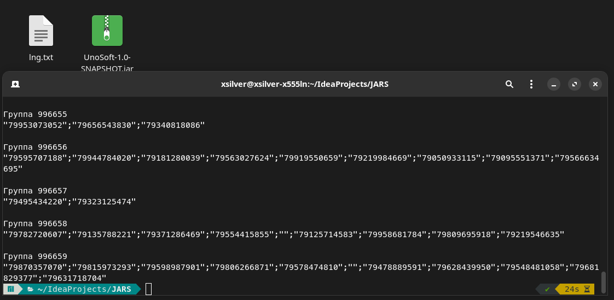
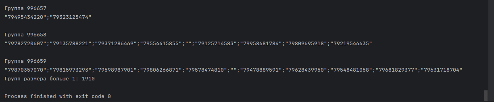
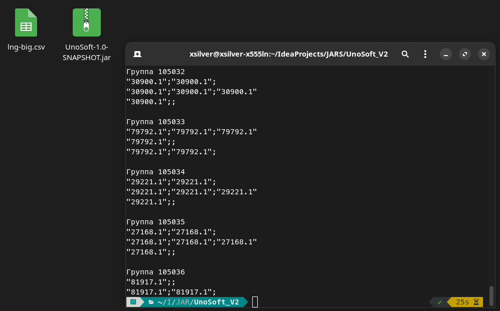
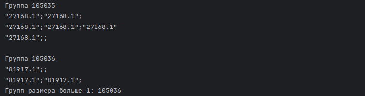

<h3>Первая версия программы</h3>

Время выполнения jar-файла 24 секунды
Команда: java -Xmx1G -jar UnoSoft-1.0-SNAPSHOT.jar lng.txt

___
Групп размера больше 1: 1910

P.S. Вывод общего количества групп перенесён вниз для показательности, в итоговом решении всё соответствует ТЗ

<h3>Вторая версия программы</h3>

Время выполнения jar-файла 25 секунд
Команда: java -Xmx1G -jar UnoSoft-1.0-SNAPSHOT.jar lng-big.csv

___

Групп размера больше 1: 105036

P.S. Поменялась маска regex